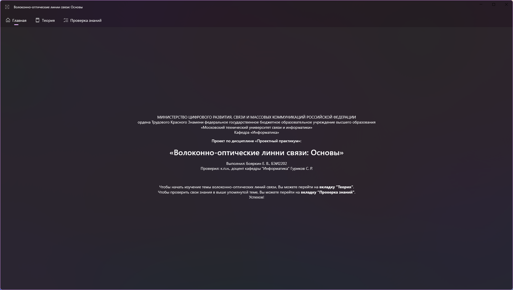
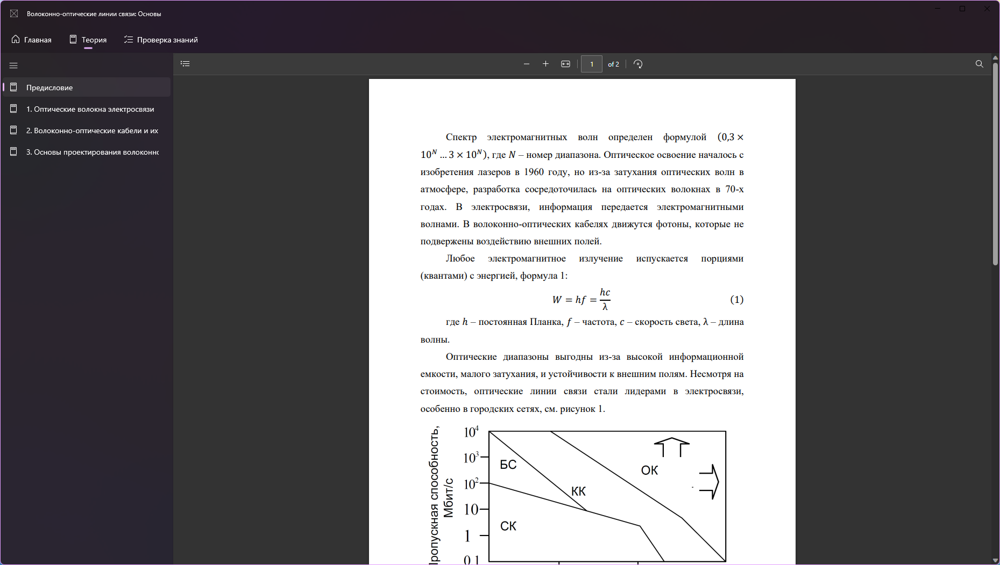
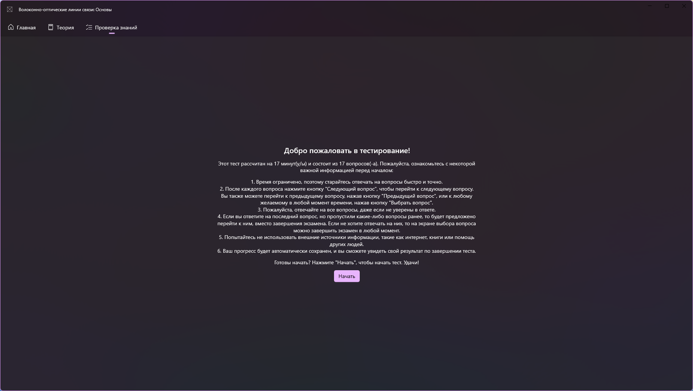
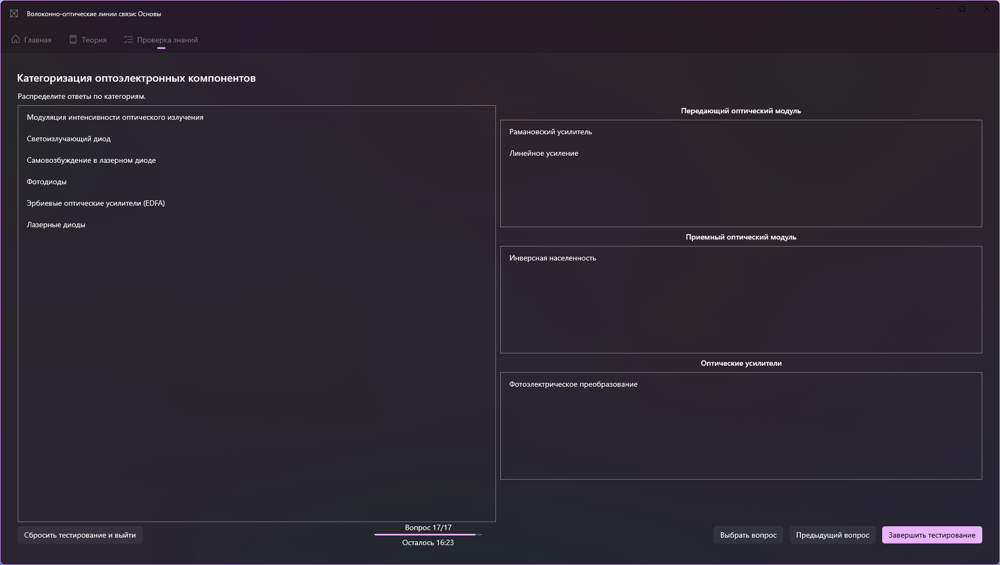

# FiberOpticCommsCourseware (Uni.Sem3.ProjectPractice)

**FiberOpticCommsCourseware** is a project for learning about fiber-optic communication. It is also coursework for 3rd semester of the university course "Project practice".

## Overview

The application contains three main pages:

### 1. Welcome page

Contains basic information about development (per requirement of the university) and short usage guide.

### 2. Theory page

Used book: Engibaryan, I. A. Fiber-Optic Communication Lines: Study Guide / I. A. Engibaryan, V. V. Zuev. - Moscow: IPR Media, 2022. - 160 p. - ISBN 978-5-4497-1707-8. - Text: electronic // Digital Educational Resource IPR SMART: [website]. - URL: <https://www.iprbookshop.ru/122221.html> (accessed on 25.01.2024). - Access mode: for authorized users. - DOI: <https://doi.org/10.23682/122221>.

Book is significantly shortened and split to introduction with 3 chapters.
Chapters are stored in an SQLite database in blobs as plain PDF files that are displayed using Micorosft Edge WebView2.

### 3. Exam page

Contains 4 main types of pages: start page, question page, question select page and results page.

Exam questions and answers are stored in SQLite database.
There are 6 question types: single choice, multiple choice, free input, ordering, selection in range and classification.
Pages for every question are generated dynamically depending on question type.

Start page:

Classification question page:

## Used technologies

- C++/WinRT
  - C++20
  - HybridCRT
- Windows App SDK (WinUI 3)
  - Unpackaged
  - Self-contained
- Microsoft Edge WebView2
- SQLite
- Yandex.Cloud (Cloud functions and S3-compatible storage)
- InnoSetup

Uses parts of [Windows Terminal](https://github.com/microsoft/terminal) and [WinUIEx](https://github.com/dotMorten/WinUIEx).
